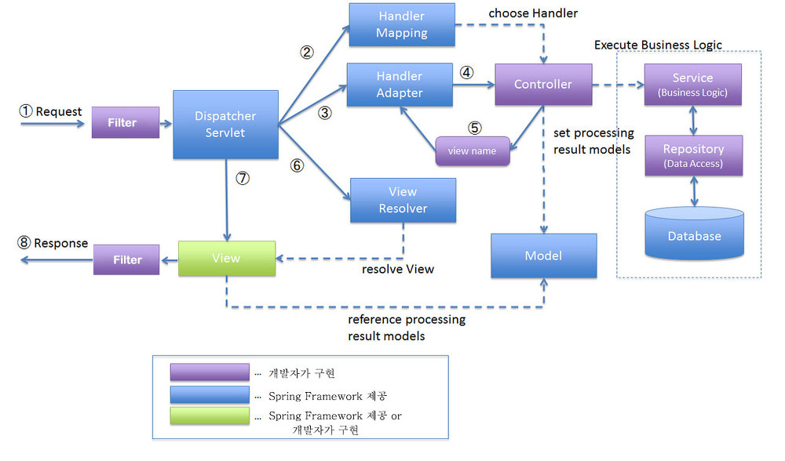
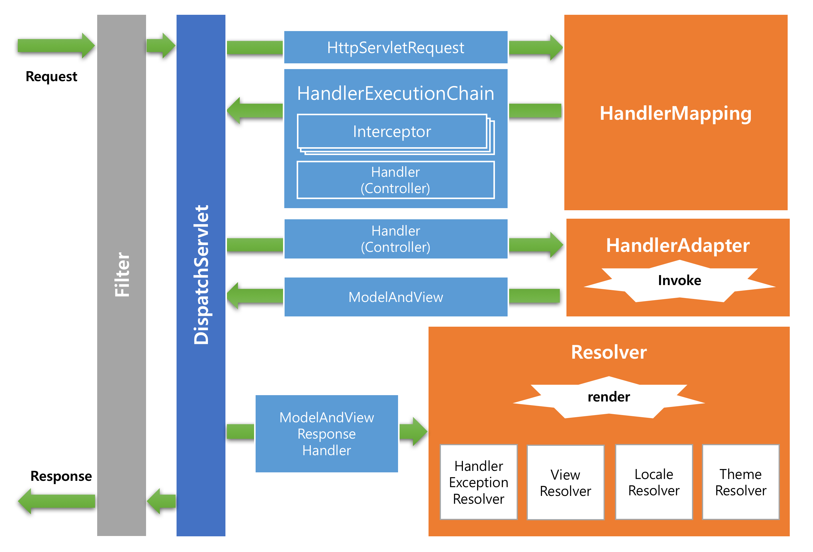

# Spring MVC

 

1. 먼저 브라우저로부터 요청이 들어오면 일단 Filter를 거치게 된다.
Filter에서 하는 대표적인 처리를 보면 Encoding이 있다.

2. 다음으로 DispatcherServlet이 Controller에 요청을 전달하기 전에 가로챈다.
요청을 가로챈 후 HandlerMapping을 통해 요청에 해당하는 적절한 Controller를 찾게 된다.
그리고 DispatcherServlet에 그것을 전달한다.

3. DispatcherServlet은 실행할 Controller 정보를 HandlerAdapter에 전달하게 된다.

4. HandlerAdapter는 해당 Controller를 호출하게 된다.

5. Controller에서는 전달된 요청을 처리한다.
요청을 처리한 후 그 결과를 Model에 담고, View의 이름을 HandlerAdapter에게 전달하게 된다.

6. 전달받은 View의 이름을 가지고 ViewResolver에서 매핑된 View를 찾아서 반환한다.

7. DispatcherServlet은 반환된 View를 넘기게 된다.
  

 

1. 요청받은 Request로부터 실행할 Controller 추출을 위해 HandlerMapping을 통해 실행할 Handler 및 Interceptor를 전달.
2. Interceptor의 preHandle을 실행.
3. HandlerAdapter에 Handler를 전달하여 해당 Controller의 Argument 매핑 및 Method Invoke를 실행하고 결과를 ModelAndView 형태로 반환.
4. Interceptor의 postHandle을 실행.
5. Resolver를 통해 실제 보여줄 View를 렌더링하여 Response에 Write한다.
6. Interceptor의 afterCompletion을 실행.
  

https://all-record.tistory.com/164  
https://jistol.github.io/java/2018/03/17/spring-mvc-structure/  
https://opennote46.tistory.com/157  
  

 

 