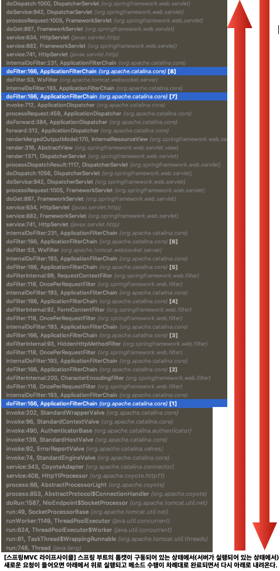

# Spring MVC

 

1. 먼저 브라우저로부터 요청이 들어오면 일단 Filter를 거치게 된다.
Filter에서 하는 대표적인 처리를 보면 Encoding이 있다.

2. 다음으로 DispatcherServlet이 Controller에 요청을 전달하기 전에 가로챈다.
요청을 가로챈 후 HandlerMapping을 통해 요청에 해당하는 적절한 Controller를 찾게 된다.
그리고 DispatcherServlet에 그것을 전달한다.

3. DispatcherServlet은 실행할 Controller 정보를 HandlerAdapter에 전달하게 된다.

4. HandlerAdapter는 해당 Controller를 호출하게 된다.

5. Controller에서는 전달된 요청을 처리한다.
요청을 처리한 후 그 결과를 Model에 담고, View의 이름을 HandlerAdapter에게 전달하게 된다.

6. 전달받은 View의 이름을 가지고 ViewResolver에서 매핑된 View를 찾아서 반환한다.

7. DispatcherServlet은 반환된 View를 넘기게 된다.
  

 

1. 요청받은 Request로부터 실행할 Controller 추출을 위해 HandlerMapping을 통해 실행할 Handler 및 Interceptor를 전달.
2. Interceptor의 preHandle을 실행.
3. HandlerAdapter에 Handler를 전달하여 해당 Controller의 Argument 매핑 및 Method Invoke를 실행하고 결과를 ModelAndView 형태로 반환.
4. Interceptor의 postHandle을 실행.
5. Resolver를 통해 실제 보여줄 View를 렌더링하여 Response에 Write한다.
6. Interceptor의 afterCompletion을 실행.
  

https://all-record.tistory.com/164  
https://jistol.github.io/java/2018/03/17/spring-mvc-structure/  
https://opennote46.tistory.com/157  
  

 

    

# Filter, Interceptor, AOP의 흐름

 

https://goddaehee.tistory.com/154  
  

# Filter

## 스프링부트에서 Filter 설정 방법

### 1. FilterRegistrationBean으로 필터 등록하는 방법

<pre>
@Slf4j
public class TestFilter implements Filter {

    @Override
    public void init(FilterConfig filterConfig) throws ServletException {
        log.info("init TestFilter");
    }

    @Override
    public void doFilter(ServletRequest servletRequest, ServletResponse servletResponse, FilterChain filterChain) throws IOException, ServletException {
        log.info("----------- before filter -----------");
        filterChain.doFilter(servletRequest, servletResponse);
        log.info("----------- after filter -----------");
    }

    @Override
    public void destroy() {
        log.info("destroy TestFilter");
    }

}
</pre>
<pre>
@Configuration
public class FilterConfiguration implements WebMvcConfigurer {

    @Bean
    public FilterRegistrationBean getFilterRegistrationBean() {
        FilterRegistrationBean filterRegistrationBean = new FilterRegistrationBean(new TestFilter());
        filterRegistrationBean.setOrder(Integer.MIN_VALUE);
        // filterRegistrationBean.addUrlPatterns("/*");
        filterRegistrationBean.setUrlPatterns(Arrays.asList("/test/*"));
        return filterRegistrationBean;
    }

}
</pre>

### 2. @WebFilter, @ServletComponentScan 애노테이션으로 필터 등록하는 방법

<pre>
@Slf4j
@WebFilter(urlPatterns = "/test/*")
public class TestFilter implements Filter {

    @Override
    public void init(FilterConfig filterConfig) throws ServletException {
        log.info("init TestFilter");
    }

    @Override
    public void doFilter(ServletRequest servletRequest, ServletResponse servletResponse, FilterChain filterChain) throws IOException, ServletException {
        log.info("----------- before filter -----------");
        filterChain.doFilter(servletRequest, servletResponse);
        log.info("----------- after filter -----------");
    }

    @Override
    public void destroy() {
        log.info("destroy TestFilter");
    }

}
</pre>
<pre>
@ServletComponentScan
@Slf4j
@SpringBootApplication
public class TestApplication {

    public static void main(String[] args) {
        log.info("##### logback(lombok) log start!!");
        SpringApplication.run(TestApplication.class, args);
    }

}
</pre>

 
https://linked2ev.github.io/gitlog/2019/09/15/springboot-mvc-13-%EC%8A%A4%ED%94%84%EB%A7%81%EB%B6%80%ED%8A%B8-MVC-Filter-%EC%84%A4%EC%A0%95/  
    

# Interceptor

## 스프링부트에서 Interceptor 설정 방법

<pre>
@Slf4j
public class TestInterceptor extends HandlerInterceptorAdapter {

    /**
     * PreHandle(HttpServletRequest request, HttpServletResponse response, Object handler)
     * 컨트롤러(즉 RequestMapping이 선언된 메서드 진입) 실행 직전에 동작.
     * 반환 값이 true일 경우 정상적으로 진행이 되고, false일 경우 실행이 멈춥니다.(컨트롤러 진입을 하지 않음)
     * 전달인자 중 Object handler는 핸들러 매핑이 찾은 컨트롤러 클래스 객체입니다.
     */
    @Override
    public boolean preHandle(HttpServletRequest request, HttpServletResponse response, Object handler) throws Exception {
        log.info("##### [TestInterceptor] ----------- preHandle -----------");
        return true;
    }

    /**
     * PostHandle(HttpServletRequest request, HttpServletResponse response, Object handler, ModelAndView modelAndView)
     * 컨트롤러 진입 후 view가 랜더링 되기 전 수행이 됩니다.
     * 전달인자의 modelAndView을 통해 화면 단에 들어가는 데이터 등의 조작이 가능합니다.
     */
    @Override
    public void postHandle(HttpServletRequest request, HttpServletResponse response, Object handler, ModelAndView modelAndView) throws Exception {
        log.info("##### [TestInterceptor] ----------- postHandle -----------");
    }

    /**
     * afterComplete(HttpServletRequest request, HttpServletResponse response, Object handler, Exception ex)
     * 컨트롤러 진입 후 view가 정상적으로 랜더링 된 후 제일 마지막에 실행이 되는 메서드입니다.
     */
    @Override
    public void afterCompletion(HttpServletRequest request, HttpServletResponse response, Object handler, Exception ex) throws Exception {
        log.info("##### [TestInterceptor] ----------- afterCompletion -----------");
    }

    /**
     * afterConcurrentHandlingStarted(HttpServletRequest request, HttpServletResponse response, Object handler)
     * Servlet 3.0부터 비동기 요청이 가능해짐에 따라 비동기 요청 시 PostHandle와 afterCompletion메서드를 수행하지 않고 이 메서드를 수행하게 됩니다. (Spring에서 제공함)
     */
    @Override
    public void afterConcurrentHandlingStarted(HttpServletRequest request, HttpServletResponse response, Object handler) throws Exception {
        log.info("##### [TestInterceptor] ----------- afterConcurrentHandlingStarted -----------");
    }

}
</pre>
<pre>
@Configuration
public class InterceptorConfiguration implements WebMvcConfigurer {

    @Override
    public void addInterceptors(InterceptorRegistry registry) {
        registry.addInterceptor(new TestInterceptor())
                .addPathPatterns("/test/*")
                .excludePathPatterns("/user/login");
    }

}
</pre>

 
https://elfinlas.github.io/2017/12/28/SpringBootInterceptor/  
    

# AOP

#### 조인포인트(Joinpoint)
클라이언트가 호출하는 모든 비즈니스 메소드, 조인포인트 중에서 포인트컷되기 때문에 포인트컷의 후보로 생각할 수 있다. 
#### 포인트컷(Pointcut)
특정 조건에 의해 필터링된 조인포인트, 수많은 조인포인트 중에 특정 메소드에서만 횡단 공통기능을 수행시키기 위해서 사용한다. 
> 표현식 : 리턴타입 패키지경로 클래스명 메소드명(매개변수)
#### 어드바이스(Advice)
횡단 관심에 해당하는 공통 기능의 코드, 독립된 클래스의 메소드로 작성한다. 
> ** 어드바이스의 동작 시점 
> Before: 메소드 실행 전에 동작 
> After: 메소드 실행 후에 동작 
> After-returning: 메소드가 정상적으로 실행된 후에 동작 
> After-throwing: 예외가 발생한 후에 동작 
> Around: 메소드 호출 이전, 이후, 예외발생 등 모든 시점에서 동작 
#### 위빙(Weaving)
포인트컷으로 지정한 핵심 관심 메소드가 호출될 때, 어드바이스에 해당하는 횡단 관심 메소드가 삽입되는 과정을 의미한다.  
이를 통해 비즈니스 메소드를 수정하지 않고도 횡단 관심에 해당하는 기능을 추가하거나 변경이 가능해진다. 
#### 애스팩트(Aspect)
포인트컷과 어드바이스의 결합이다. 어떤 포인트컷 메소드에 대해 어떤 어드바이스 메소드를 실행할지 결정한다. 
 
https://sjh836.tistory.com/157  
  

## 스프링부트에서 AOP 설정 방법

https://jeong-pro.tistory.com/171  
    

# Filter, Interceptor, AOP 실행 결과
http://localhost:8080/test/test_aspect 실행 시 아래와 같은 순서대로 로그가 출력된다.  
<pre>
##### [TestFilter] ----------- before filter -----------
##### [TestInterceptor] ----------- preHandle -----------
##### [TestAspect] ----------- Around, Start (sombrero.service.TestService / test_aspect) -----------
##### [TestAspect] ----------- Before -----------
##### TestService - test_aspect()!!
##### [TestAspect] ----------- Around, End (sombrero.service.TestService / test_aspect) -----------
##### [TestAspect] ----------- After -----------
##### [TestAspect] ----------- AfterReturning, str: null -----------
##### [TestInterceptor] ----------- postHandle -----------
##### [TestInterceptor] ----------- afterCompletion -----------
##### [TestFilter] ----------- after filter -----------
</pre>
